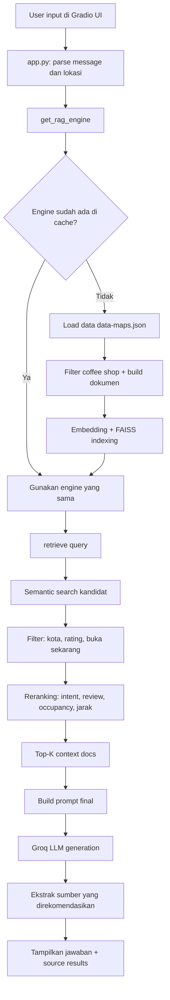

# Simple Groq Chatbot

Proyek ini adalah sistem rekomendasi coffee shop berbasis RAG (Retrieval-Augmented Generation) untuk wilayah Lampung.
Chatbot memanfaatkan data Google Maps di `data/data-maps.json` untuk mencari tempat yang relevan, lalu menghasilkan jawaban yang faktual berdasarkan context retrieval.
Fokus utama proyek ini adalah membantu pengguna menemukan dan membandingkan coffee shop di Lampung berdasarkan lokasi, rating, jam buka, tingkat keramaian, dan informasi pendukung lainnya.

## Alur sistem (step-by-step)

1. Pengguna mengirim pertanyaan dari UI Gradio di `app.py`.
2. Aplikasi mengambil input pendukung (misalnya lokasi pengguna jika tersedia).
3. `app.py` memanggil `get_rag_engine()` untuk mengambil instance `CoffeeRAG`.
4. Saat startup pertama, `CoffeeRAG`:
   - Membaca `data/data-maps.json`
   - Memfilter data yang relevan dengan coffee shop
   - Membangun dokumen konteks per tempat (nama, alamat, rating, review, jam buka, popular times, koordinat, dll)
   - Membuat embedding dengan `sentence-transformers`
   - Menyusun FAISS index untuk semantic retrieval
5. Untuk setiap pertanyaan, `rag.retrieve(...)` dijalankan:
   - Semantic search top kandidat berbasis embedding
   - Filter tambahan (kota, rating minimum, buka sekarang)
   - Reranking hybrid (kecocokan token, rating/review, jam ramai/sepi, jarak terdekat)
6. Top dokumen hasil retrieval disusun menjadi context terstruktur (dengan ID sumber, metadata penting, dan ringkasan fakta).
7. `app.py` membangun prompt final (system prompt + context + pertanyaan pengguna).
8. Prompt dikirim ke model Groq untuk menghasilkan jawaban.
9. Jawaban diproses untuk mengekstrak referensi dokumen yang direkomendasikan.
10. UI menampilkan:
	- Jawaban asisten
	- Source results (nama tempat, rating, alamat, jam buka, popular times, link Google Maps)

## Flowchart alur RAG



Fitur utama:

1. Filter kota
2. Rating minimum
3. Opsi `buka sekarang`
4. Source results berurutan dari hasil retrieval
5. Link langsung ke Google Maps dari koordinat `lat,lng`

## Jalankan lokal

```powershell
python -m venv .venv
.\.venv\Scripts\Activate.ps1
pip install -r requirements.txt
Copy-Item .env.example .env
```

Isi `GROQ_API_KEY` di file `.env`, lalu jalankan:

```powershell
python app.py
```

Saat pertama kali dijalankan, aplikasi akan:

1. Memfilter entri yang relevan dengan coffee shop
2. Membentuk dokumen konteks dari field seperti nama, kategori, alamat, rating, review, jam buka, popular times, menu, telepon, dan koordinat
3. Membuat embedding dengan `sentence-transformers`
4. Menyusun index FAISS untuk retrieval
5. Mengirim context hasil retrieval ke Groq untuk menjawab pertanyaan pengguna

## Deploy ke Hugging Face Spaces

1. Buat Space baru dengan SDK `Gradio`.
2. Upload file project ini ke Space.
3. Buka `Settings > Secrets`.
4. Tambahkan secret `GROQ_API_KEY`.
5. Opsional: tambahkan `GROQ_MODEL`.
6. Opsional: tambahkan `EMBEDDING_MODEL` jika ingin mengganti model embedding.

Contoh value:

```text
GROQ_MODEL=llama-3.1-8b-instant
```

Setelah build selesai, chatbot akan otomatis tampil sebagai web app.
